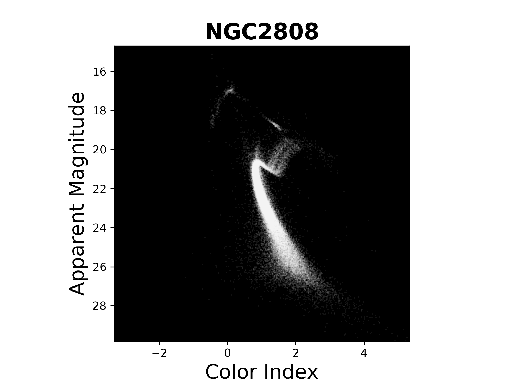

# Exploring Hertzsprung Russell Diagrams  

 
    

Winter project taken up in 2019,  under [Krittika - Astronomy Club of IIT Bombay](https://www.facebook.com/KrittikaIITB/) ([@krittikaiitb](https://github.com/krittikaiitb)).     

Most data was taken from [HST UV Globular Cluster Survey ("HUGS")](https://archive.stsci.edu/prepds/hugs/).

---

- [Related code](Code)
- [Project report and presentation slides](Reports)